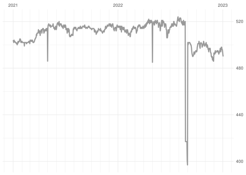
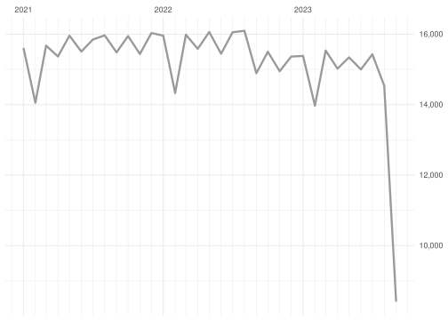
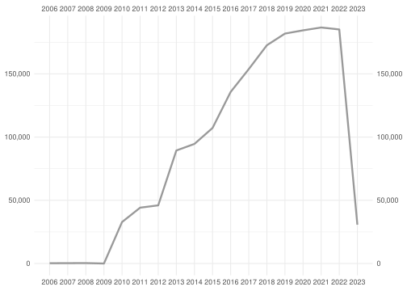

  - [ODES DB](#odes-db)
      - [Daily summary](#daily-summary)
      - [Monthly summary](#monthly-summary)
      - [Yearly summary](#yearly-summary)

# ODES DB

Updated on: 2023-02-23 04:19:59

-----

## Daily summary

<!-- -->

Count of last 2 week:

| fecha\_hora |   n |
| :---------- | --: |
| 2023-02-23  | 151 |
| 2023-02-22  | 495 |
| 2023-02-21  | 495 |
| 2023-02-20  | 494 |
| 2023-02-19  | 494 |
| 2023-02-18  | 495 |
| 2023-02-17  | 495 |
| 2023-02-16  | 496 |
| 2023-02-15  | 496 |
| 2023-02-14  | 495 |
| 2023-02-13  | 494 |
| 2023-02-12  | 494 |
| 2023-02-11  | 495 |
| 2023-02-10  | 496 |

## Monthly summary

<!-- -->

Count of last 12 months:

| fecha\_hora |      n |
| :---------- | -----: |
| 2023-02-01  | 11,059 |
| 2023-01-01  | 15,262 |
| 2022-12-01  | 15,328 |
| 2022-11-01  | 14,841 |
| 2022-10-01  | 15,493 |
| 2022-09-01  | 14,892 |
| 2022-08-01  | 15,257 |
| 2022-07-01  | 16,055 |
| 2022-06-01  | 15,444 |
| 2022-05-01  | 16,031 |
| 2022-04-01  | 15,554 |
| 2022-03-01  | 15,955 |

## Yearly summary

<!-- -->

Count of last 10 years:

| fecha\_hora |       n |
| :---------- | ------: |
| 2023-01-01  |  26,321 |
| 2022-01-01  | 185,106 |
| 2021-01-01  | 186,664 |
| 2020-01-01  | 184,413 |
| 2019-01-01  | 181,845 |
| 2018-01-01  | 172,613 |
| 2017-01-01  | 153,768 |
| 2016-01-01  | 135,683 |
| 2015-01-01  | 107,205 |
| 2014-01-01  |  94,605 |
