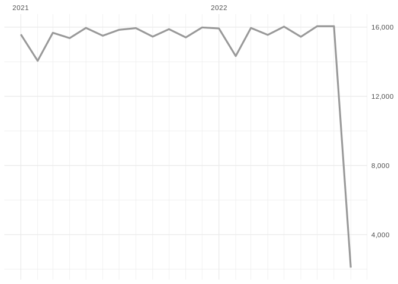
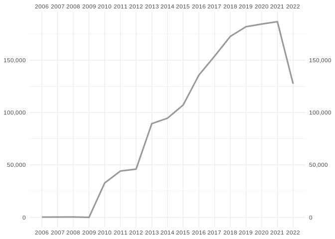

-   <a href="#odes-db" id="toc-odes-db">ODES DB</a>
    -   <a href="#daily-summary" id="toc-daily-summary">Daily summary</a>
    -   <a href="#monthly-summary" id="toc-monthly-summary">Monthly summary</a>
    -   <a href="#yearly-summary" id="toc-yearly-summary">Yearly summary</a>

# ODES DB

Updated on 2022-08-02 19:07:46

------------------------------------------------------------------------

## Daily summary

<!-- -->

Count of last 2 week:

| fecha_hora |   n |
|:-----------|----:|
| 2022-08-03 | 466 |
| 2022-08-02 | 519 |
| 2022-08-01 | 514 |
| 2022-07-31 | 519 |
| 2022-07-30 | 522 |
| 2022-07-29 | 521 |
| 2022-07-28 | 519 |
| 2022-07-27 | 519 |
| 2022-07-26 | 517 |
| 2022-07-25 | 515 |
| 2022-07-24 | 515 |
| 2022-07-23 | 516 |
| 2022-07-22 | 516 |
| 2022-07-21 | 516 |

## Monthly summary

<!-- -->

Count of last 12 months:

| fecha_hora |      n |
|:-----------|-------:|
| 2022-08-01 |  1,499 |
| 2022-07-01 | 16,021 |
| 2022-06-01 | 15,445 |
| 2022-05-01 | 16,025 |
| 2022-04-01 | 15,544 |
| 2022-03-01 | 15,951 |
| 2022-02-01 | 14,323 |
| 2022-01-01 | 15,929 |
| 2021-12-01 | 15,974 |
| 2021-11-01 | 15,400 |
| 2021-10-01 | 15,881 |
| 2021-09-01 | 15,450 |

## Yearly summary

<!-- -->

Count of last 10 years:

| fecha_hora |       n |
|:-----------|--------:|
| 2022-01-01 | 110,737 |
| 2021-01-01 | 186,549 |
| 2020-01-01 | 184,271 |
| 2019-01-01 | 181,752 |
| 2018-01-01 | 172,525 |
| 2017-01-01 | 153,675 |
| 2016-01-01 | 135,735 |
| 2015-01-01 | 108,158 |
| 2014-01-01 |  94,942 |
| 2013-01-01 |  89,788 |
