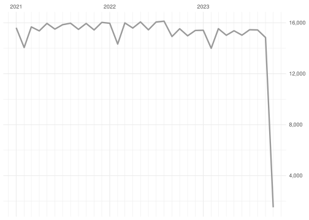

  - [ODES DB](#odes-db)
      - [Daily summary](#daily-summary)
      - [Monthly summary](#monthly-summary)
      - [Yearly summary](#yearly-summary)

# ODES DB

Updated on: 2023-09-09 16:39:32.359183

-----

## Daily summary

<!-- -->

Count of last 2 week:

| fecha\_hora |   n |
| :---------- | --: |
| 2023-09-09  | 500 |
| 2023-09-08  | 500 |
| 2023-09-07  | 500 |
| 2023-09-06  | 498 |
| 2023-09-05  | 498 |
| 2023-09-04  | 499 |
| 2023-09-03  | 498 |
| 2023-09-02  | 499 |
| 2023-09-01  | 498 |
| 2023-08-31  | 470 |
| 2023-08-30  | 470 |
| 2023-08-29  | 470 |
| 2023-08-28  | 470 |
| 2023-08-27  | 469 |

## Monthly summary

<!-- -->

Count of last 12 months:

| fecha\_hora |      n |
| :---------- | -----: |
| 2023-09-01  |  4,490 |
| 2023-08-01  | 14,535 |
| 2023-07-01  | 15,428 |
| 2023-06-01  | 15,000 |
| 2023-05-01  | 15,342 |
| 2023-04-01  | 15,022 |
| 2023-03-01  | 15,536 |
| 2023-02-01  | 13,970 |
| 2023-01-01  | 15,383 |
| 2022-12-01  | 15,364 |
| 2022-11-01  | 14,949 |
| 2022-10-01  | 15,500 |

## Yearly summary

<!-- -->

Count of last 10 years:

| fecha\_hora |       n |
| :---------- | ------: |
| 2023-01-01  | 124,706 |
| 2022-01-01  | 186,219 |
| 2021-01-01  | 186,886 |
| 2020-01-01  | 185,053 |
| 2019-01-01  | 182,317 |
| 2018-01-01  | 172,618 |
| 2017-01-01  | 154,122 |
| 2016-01-01  | 136,047 |
| 2015-01-01  | 107,239 |
