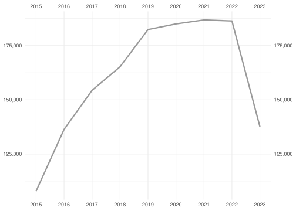

  - [ODES DB](#odes-db)
      - [Daily summary](#daily-summary)
      - [Monthly summary](#monthly-summary)
      - [Yearly summary](#yearly-summary)

# ODES DB

Updated on: 2022-12-19 08:19:23

-----

## Daily summary

<!-- -->

Count of last 2 week:

| fecha\_hora |   n |
| :---------- | --: |
| 2022-12-19  | 485 |
| 2022-12-18  | 486 |
| 2022-12-17  | 488 |
| 2022-12-16  | 489 |
| 2022-12-15  | 491 |
| 2022-12-14  | 492 |
| 2022-12-13  | 492 |
| 2022-12-12  | 493 |
| 2022-12-11  | 492 |
| 2022-12-10  | 492 |
| 2022-12-09  | 492 |
| 2022-12-08  | 492 |
| 2022-12-07  | 491 |
| 2022-12-06  | 493 |

## Monthly summary

<!-- -->

Count of last 12 months:

| fecha\_hora |      n |
| :---------- | -----: |
| 2022-12-01  |  9,322 |
| 2022-11-01  | 14,841 |
| 2022-10-01  | 15,493 |
| 2022-09-01  | 14,892 |
| 2022-08-01  | 15,257 |
| 2022-07-01  | 16,055 |
| 2022-06-01  | 15,444 |
| 2022-05-01  | 16,031 |
| 2022-04-01  | 15,554 |
| 2022-03-01  | 15,955 |
| 2022-02-01  | 14,329 |
| 2022-01-01  | 15,927 |

## Yearly summary

<!-- -->

Count of last 10 years:

| fecha\_hora |       n |
| :---------- | ------: |
| 2022-01-01  | 179,100 |
| 2021-01-01  | 186,664 |
| 2020-01-01  | 184,413 |
| 2019-01-01  | 181,845 |
| 2018-01-01  | 172,613 |
| 2017-01-01  | 153,768 |
| 2016-01-01  | 135,683 |
| 2015-01-01  | 107,205 |
| 2014-01-01  |  94,605 |
| 2013-01-01  |  89,405 |
